# Liquid模板的学习和使用#

## 一、Liquid的认识

第一次接触`Liquid`是在公司博客修改上，刚开始使用觉得很陌生，也查阅了很多资料去学习，在折腾博客的时候, 遇到一些`jekyll`问题,正确来说应该是`Liquid`用法的问题。

`Liquid`有两种标记类型：`Output` 和 ` Tag`.

- `Output`标记，用于输出文本，格式采用 `{{ 两个尖括号包围 }}`
- `Tag`标记，用于执行命令或者处理 格式: `{\% 一对尖括号内一对百分号 \%}`

我的理解就是: 对比`jsp`格式来说,
`Output`相当于 ` <%=variable%>`，就是用来输出变量值展示在页面上;
`Tag`相当于`<% int i=2; %>`,一种数据处理和定义,但不做输出效果.

通过`Tag`的数据处理得到想要的数据再通过`Output`输出达到使用者需要的效果和`jsp`相似；

## 二、Output

例子:

	Hello {{name}}
 	Hello {{user.name}}
 	Hello {{ 'tobi' }}

#### 高级Output: Filters//过滤器

Filters过滤器,数据处理的操作方法.
过滤器的第一个参数，往往是过滤器运算符'|'左边的`Output`，而过滤器的返回值，是通过过滤运算符右边的操作所得到的，过滤器可以叠加操作，最终得到该`Output`所要输出的值。(这段我见解，翻译不过来
 = =)
如下：

```
Hello {{ 'tobi' | upcase }}
Hello tobi has {{ 'tobi' | size }} letters!
Hello {{ 'now' | date: "%Y %h" }}
```

#### 标准过滤器

- `date` - 格式化时间
- `capitalize` - 输出字符串，字符串（句子）首字母大写 e.g. 假设tb为"hello world"`{{ tb|capitalize }} #=> 'Hello world'`
- `downcase` - 转换小写
- `upcase` - 转换大写
- `first` - 获取数组的第一个元素
- `last` - 获取数组的最后一个元素
- `join` - 用指定的字符拼接数组元素
- `sort` - 排序数组
- `map` - map/collect an array on a given property
- `size` - 返回数组大小
- `escape` - 转移字符串
- `escape_once` - returns an escaped version of html without affecting existing escaped entities
- `strip_html` - 除去字符串中的html标签?
- `strip_newlines` - 除去字符串中的回车?
- `newline_to_br` - 将所有的回车"\n" 转换成"<br />"?
- `replace` - 替换所有匹配内容 e.g.`{{ 'forfor' | replace:'for', 'bar' }} #=> 'barbar'`
- `replace_first` - 替换第一个匹配内容 e.g.`{{ 'forfor' | replace_first:'for', 'bar' }} #=> 'barfor'`
- `remove` - 移除所有匹配内容 e.g.`{{ 'forbarforbar' | remove:'for'}} #=> 'barbar'`
- `remove_first` - 移除第一个匹配内容 e.g.`{{ 'forbarforbar' | remove_first:'for'}} #=> 'barforbar'`
- `truncate` - truncate a string down to x characters
- `truncatewords` - truncate a string down to x words
- `prepend` - 在字符串前面加上内容 e.g.`{{'bar'|prepend:'far'}} #=> 'farbar'`
- `append` - 字符串后面加上内容 e.g.`{{'bar'|append: 'foo'}}#=> 'barfoo'`
- `minus` - 减法 e.g. `{{4|minus:2}} #=>2`
- `plus` - 加法 e.g. `{{ 4|plus:2}} #=> 6`
- `times` - 乘法 e.g. `{{10|times:2}} #=> 20`
- `divided_by` - 除法 e.g. `{{ 10 | divided_by:2}} #=> 5`
- `split` - 分割字符串 e.g.`{{ "a~b" | split:'~'}} #=> ['a','b']`
- `modulo` - 取余 e.g. `{{ 3 | modulo:2 }} #=> 1`

## 三、Tags

`Tag`在模板中起到处理逻辑的作用。

下面是目前支持的`Tag`:

- `assign` - 定义变量 e.g. `` 定义了变量`tt`数值为1
- `capture` - `Block tag`为变量赋值 e.g.`{{ tt }}` 将`tt`的值赋给 `dont`
- `case` - `Block tag` its the standard case...when block
- `comment` - `Block tag` 注释
- `cycle` - Cycle is usually used within a loop to alternate between values, like colors or DOM classes.
- `for` - for循环`block`
- `if` - 判断`block`
- `include` - 引入模板
- `raw` - 转义内容`tag` e.g.`{{ this }} #=> '{{ this }}'`
- `unless` - Mirror of if statement

#### Comments

注释隐藏

	We made 1 million dollars  in losses  this year
#### Raw

当包裹内容出现冲突语法时，不会执行其处理。

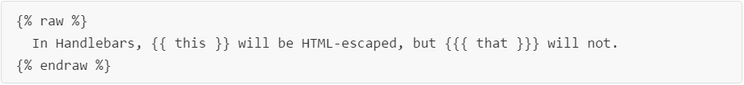

#### if/else

和java逻辑很相似就是多了大括号和百分号`&&`变成了`and`,`||`变成了`or` ；具体的用法如下所示：

e.g. 

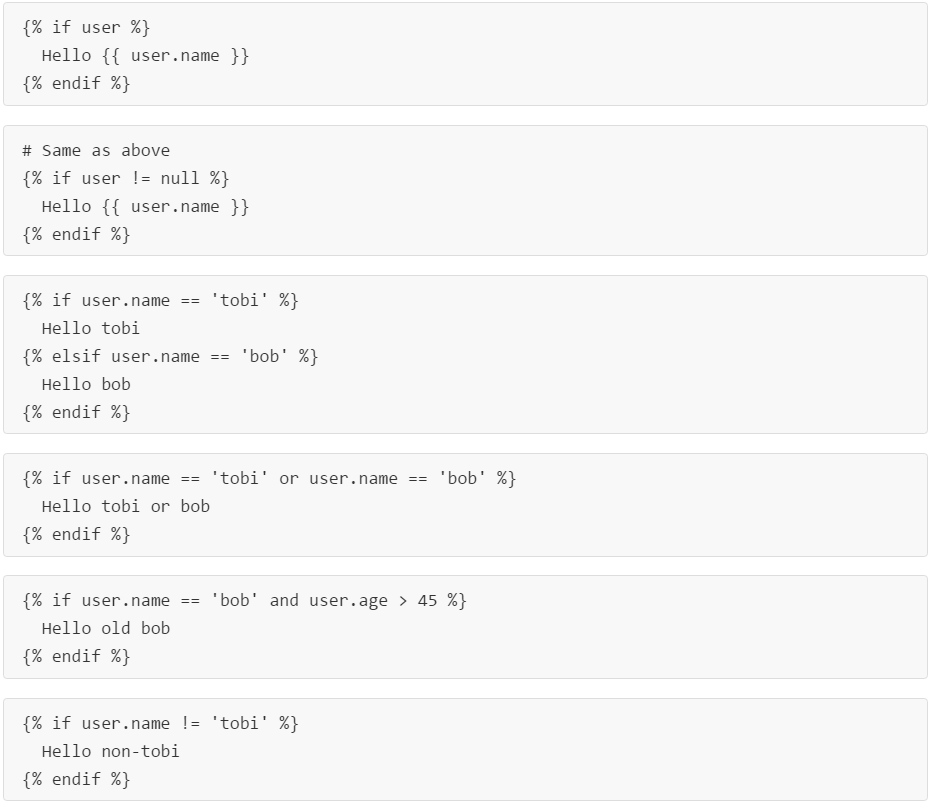

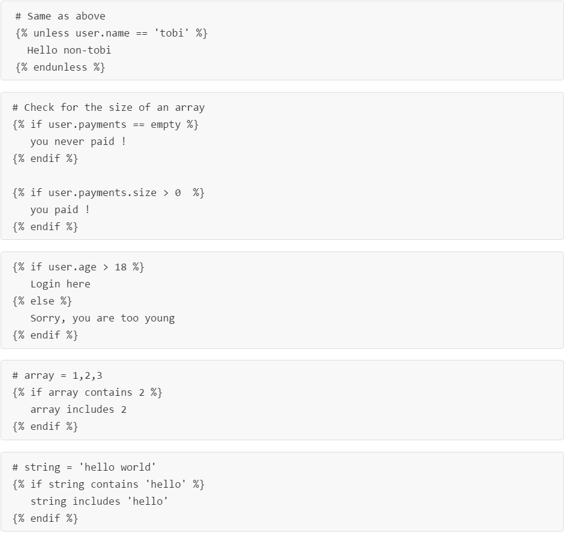

#### Case Statement

多条件

](../images/weixc4.png)

#### Cycle

循环列举

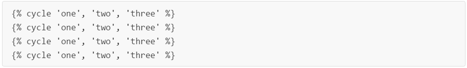

结果：

```
one
two
three
one

```

可以通过命名分组：


结果：

```
one
two
one
two
```

#### for 循环

循环集合：


遍历`hash`时：`item[0]`包含键，`item[1]`包含值

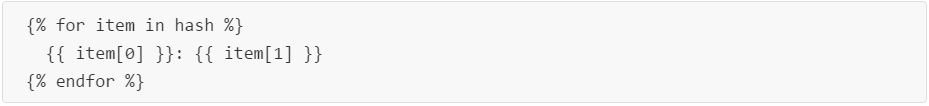

for循环时，下列变量可以辅助使用：

```
forloop.length      # => length of the entire for loop
forloop.index       # => index of the current iteration
forloop.index0      # => index of the current iteration (zero based)
forloop.rindex      # => how many items are still left?
forloop.rindex0     # => how many items are still left? (zero based)
forloop.first       # => is this the first iteration?
forloop.last        # => is this the last iteration?

```

还有一些变量可以用来处理循环时选择性处理：
`limit:int` - 限制遍历个数
`offset:int` - 从第n个数开始遍历

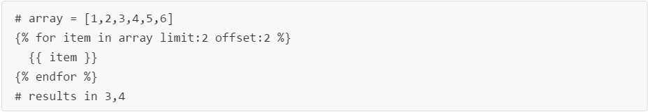

反序遍历：

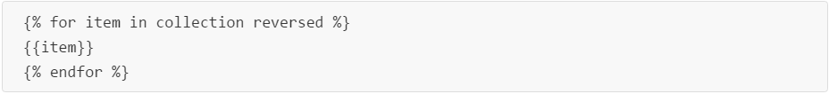

除了遍历集合，还可以定义一个范围的数字来遍历：

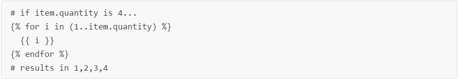

#### 变量赋值

赋值变量：

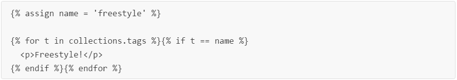

还可以赋值布尔值：

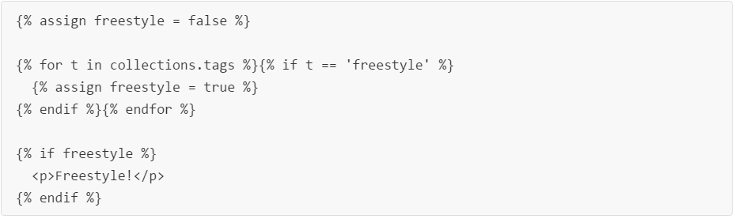

赋值处理过的数据：可以用`capture`

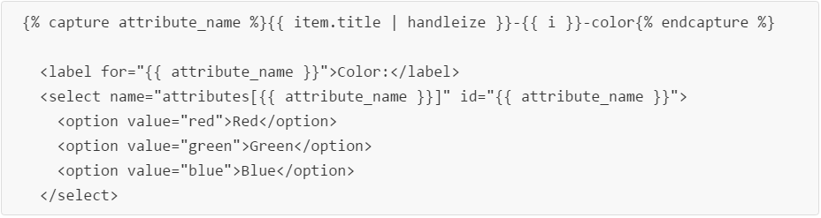
